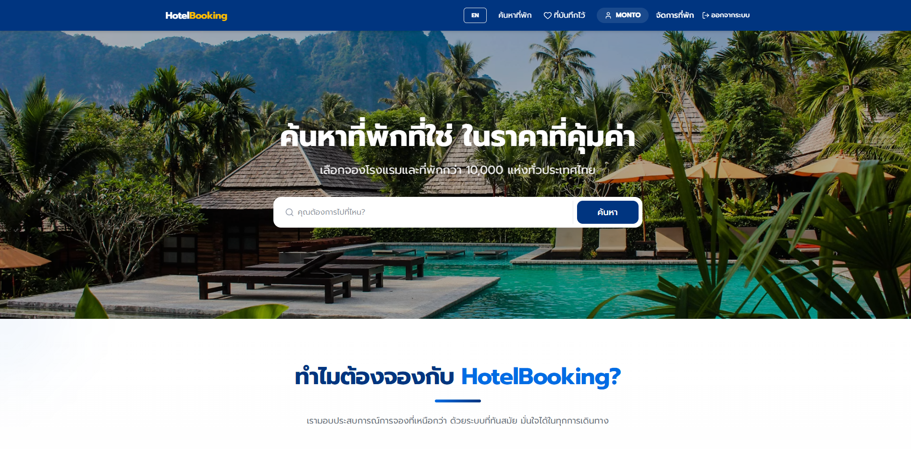
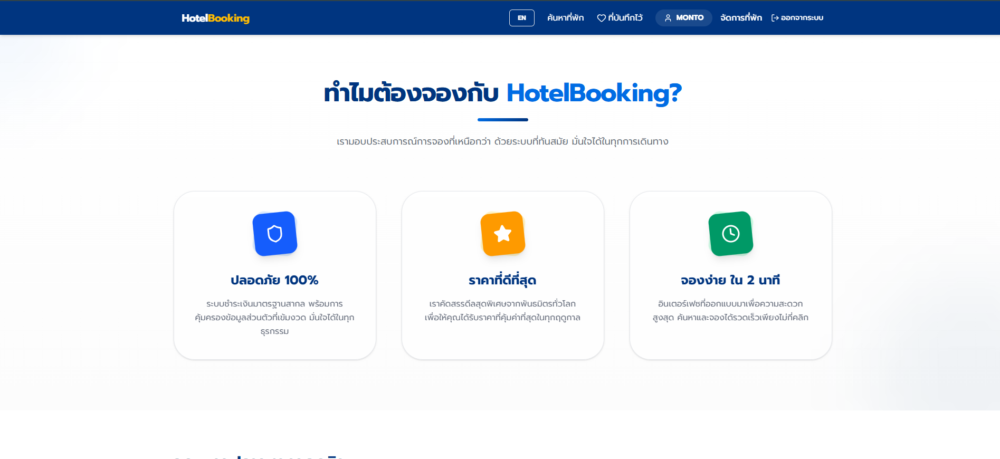
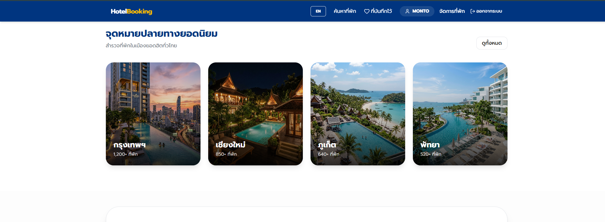
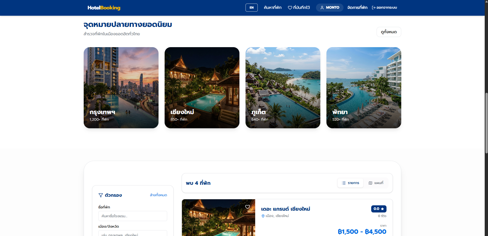
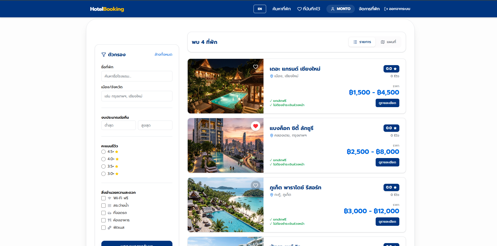
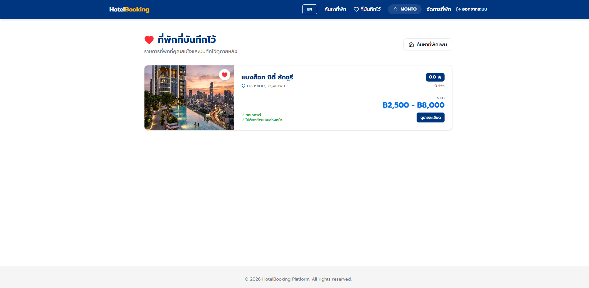
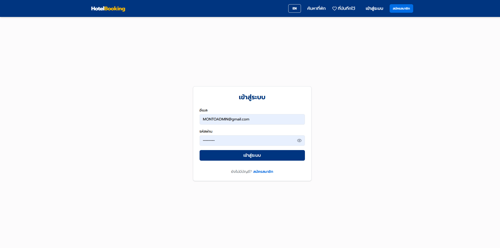
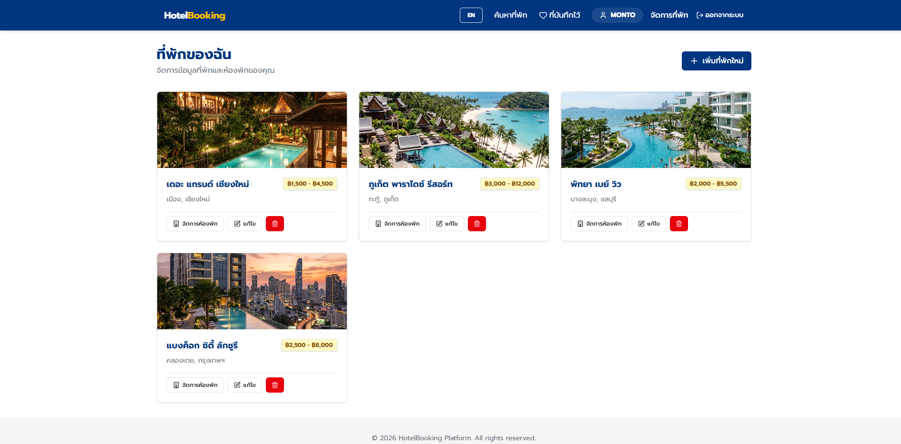

# HotelBooking

A full-stack hotel and accommodation booking platform. Guests can search and compare properties,
book rooms with real-time availability checks, pay to confirm, and review their stays — while
property owners list and manage their own properties, rooms, and pricing from a dedicated dashboard.
The interface is Thai by default and can switch to English.

It is a two-sided platform built like a real booking site: a **Next.js** (App Router) + **React**
frontend, a **NestJS** REST API, and a **PostgreSQL** database. The data layer is **raw parameterized
SQL via `pg`** (no ORM, no query builder), and the database runs on **Docker**.

---

## Screenshots

<table>
  <tr>
    <td width="50%"></td>
    <td width="50%"></td>
  </tr>
  <tr>
    <td width="50%"></td>
    <td width="50%"></td>
  </tr>
  <tr>
    <td width="50%"></td>
    <td width="50%"></td>
  </tr>
  <tr>
    <td colspan="2"></td>
  </tr>
</table>

---

## What it is

HotelBooking serves two kinds of users:

- **Travelers** — browse and search properties without signing in, and only log in when they want to
  book, pay, review, or save favorites.
- **Property owners** — list properties, upload photos, choose amenities, and manage rooms and pricing
  through their own dashboard.

The point of the project is the set of backend rules that keep the data correct automatically —
preventing double bookings, computing prices on the server, and allowing reviews only from real guests.

---

## Features

### For travelers

| Feature | Description |
| --- | --- |
| Search & compare | Search by name or province; filter by price, rating, and amenities; sort results; switch between list and map views |
| Book a room | Pick a room and check-in/out dates; nights and total price are calculated automatically; availability is verified before every confirmation |
| Pay & track status | Pay to confirm a booking and follow each booking's status from the profile page |
| Verified reviews | Rate and write reviews only for properties you have actually booked and confirmed |
| Favorites | Save properties you like and come back to them later |
| Bilingual | Switch the interface between Thai and English |

### For property owners

| Feature | Description |
| --- | --- |
| List a property | Add a property with details, address, pricing, and amenities |
| Upload images | Upload multiple property photos and choose a main image |
| Manage rooms & pricing | Add and edit room types, per-night prices, and room counts from a dashboard |
| Reply to reviews | Respond to guest reviews directly |

---

## How the platform stays reliable

- **No double booking** — every booking opens a transaction, locks the room row to serialize
  concurrent requests, and checks availability before inserting, so the same room is never overbooked.
- **Server-side pricing** — the total is computed from the real room price and the number of nights on
  the server; prices sent from the client are never trusted.
- **Verified reviews** — only guests with a confirmed or completed booking for a property can review it.
- **Role-based access** — each user can access only their own data, and owners can edit only their own
  properties.
- **Clear booking lifecycle** — pending, confirmed, completed, cancelled — visible to both guests and
  owners.

---

## Tech stack

### Frontend

| Technology | Purpose |
| --- | --- |
| **Next.js 16** (App Router) + **React 19** | Web framework and routing |
| **TypeScript** | Type safety |
| **Tailwind CSS v4** | Styling and UI |
| **Zustand** | Client-side state (auth, favorites, language) with persistence |
| **TanStack React Query** | Data fetching and caching from the API |
| **Axios** | HTTP client with automatic token attachment and refresh |
| **React Hook Form + Zod** | Forms and validation |
| **Framer Motion** | Animations |
| **Leaflet / React-Leaflet** | Map view of properties |
| **Lucide React** | Icons |

### Backend

| Technology | Purpose |
| --- | --- |
| **NestJS 11** + **TypeScript** | Modular REST API (controller, service, repository) |
| **PostgreSQL** via **`pg`** | Database accessed with hand-written SQL (no ORM) |
| **JWT + Passport** | Authentication with access and refresh tokens |
| **bcrypt** | Password hashing |
| **Multer** | Property image uploads |

### Database & infrastructure

| Technology | Purpose |
| --- | --- |
| **PostgreSQL 15** | Primary database |
| **Docker / Docker Compose** | Runs the database and services in containers |
